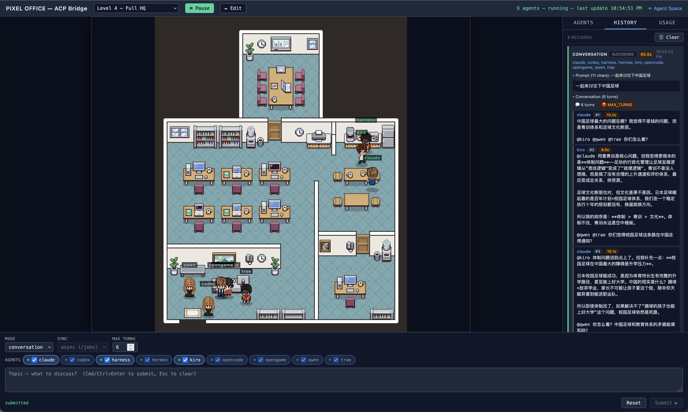

# Agent Space

Pixel-art AI Agent office — real-time visualization of ACP Bridge agents.



Agents walk to their desk when busy, wander around the office when idle. Click a sprite or sidebar card to highlight the matching agent.

## Features

- Canvas pixel-office with 5 switchable backgrounds
- Per-map editor: paint obstacles + assign per-agent home/work/idle zones on a 16×16 grid
- A* pathfinding around obstacles
- Intermittent chat bubbles + busy emoji indicators
- Command Composer: invoke ACP Bridge runs/jobs/pipelines from the UI (Quick presets + Advanced raw form, both inside the sidebar Compose tab)
- Sidebar: Agents / History / Usage / Heartbeat / ⚡ Compose tabs
- Heartbeat tab: live agent chatter feed with interval control + countdown bar
- Heartbeat Intervene: inject talking-points into all agents (ttl-bounded), or ping a single agent immediately
- Cross-device map sharing (server-side persistence)

## Quick Start

```bash
npm install
npm run dev
```

Open http://localhost:5173 in your browser.

### Production

```bash
npm run build
ACP_BRIDGE_TOKEN=<token> npm run serve
```

## Environment Variables

| Variable | Default | Description |
|----------|---------|-------------|
| `BRIDGE_URL` | `http://localhost:18010` | ACP Bridge backend URL |
| `ACP_BRIDGE_TOKEN` | *(empty)* | Bearer token for Bridge API auth |
| `PORT` | `5173` | Production server port |

## Tech Stack

- **Canvas** — direct pixel rendering, sprite state machine
- **Vite** — bundler + dev proxy
- **Express** — production static server + API proxy
- **JavaScript (ES Modules)**

## Project Structure

```
pixel.html              — main entry point
src/pixel/              — all application modules
  pixel-main.js         — boot + wiring
  PixelRenderer.js      — Canvas renderer, sprites, wander, bubbles
  BridgeAdapter.js      — bridge JSON → render config
  MapConfig.js          — grid schema, localStorage + server sync
  MapEditor.js          — grid editor (pointer events, mobile-friendly)
  PathFinder.js         — A* pathfinding
  CommandComposer.js    — form-driven agent invocation
  CommandClient.js      — HTTP client for runs/jobs/pipelines
  CommandHistory.js     — persistent history (localStorage)
  Sidebar.js            — tabs, agent cards, selection sync
  UsageView.js          — /usage token / cache stats, by-model breakdown
  HeartbeatView.js      — /heartbeat logs feed, interval control, countdown bar
  ArtifactComposer.js   — Quick-mode preset pipelines (artifacts.json)
public/pixel/           — backgrounds + character sprites + maps
serve.js                — Express prod server + API proxy
vite.config.js          — dev proxy + pixel-maps middleware
dev.sh                  — nohup-based start/stop/restart/status/logs
```

## License

See [CREDITS.md](CREDITS.md) for sprite & background attribution.
